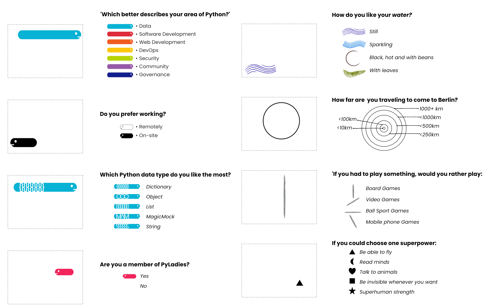

# Data_Portraits
Code to generate the Data Portraits featured on the Badges of [PyconDE &amp; PyData Berlin 2023](https://2023.pycon.de/). 

The harder parts of developing the Data portraits are:
1. Coming up with a relevant - yet non invasive -  set of questions
2. Encode the answers to an interesting design
  - First with lots of sketches
  - Then by generating single vector images for each of the answers

Here is the final design with the encodings.

For the code you find: 
- `portrait.py`: contains a simple class (Portrait) with functions to sequentially add the images corresponding to the answers to a plot with `matplotlib`. 
- `portrait_test.ipynb`: notebook file that shows how to call the different elements to create the portrait
- `app.py`: streamlit app to play with generating different portraits easily. To run:
   'streamlit run app.py'

