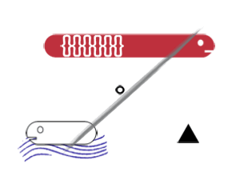

# Data_Portraits
Code to generate the Data Portraits featured on the Badges of [PyconDE &amp; PyData Berlin 2023](https://2023.pycon.de/). 

The harder parts of developing the Data portraits are:
1. Coming up with a relevant - yet non invasive -  set of questions
2. Encode the answers to an interesting design
  - First on sketches
  - Then by generating single vector images for each of the answers

Then the code is a simple class with functions to sequentially add the images corresponding to the answers to a plot with matplotlib. 

You can play with the Portrait Generator here. 

